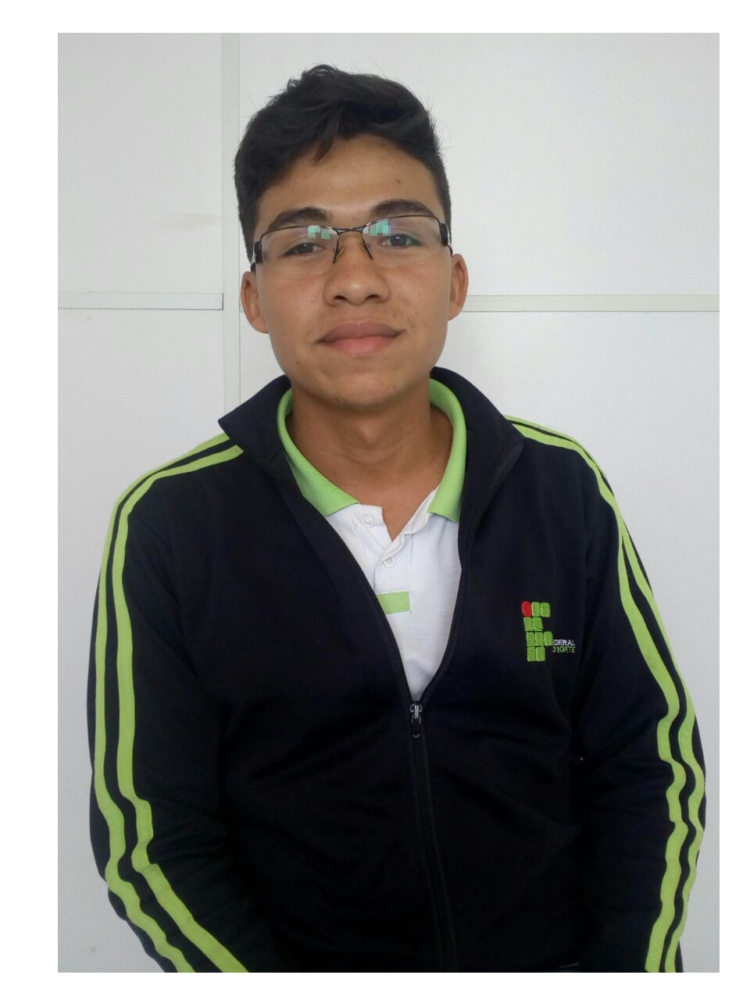

Criando **minha**, _página_,  ~~principal~~.

# Quem sou eu

 Olá! Me chamo Tailson.   
Sou estudante do IFRN/Campus Ceará-Mirim, do curso técnico em Programação de Jogos Digitais.   
**VEM CONHECER MEUS JOGOS**
# Informações pessoais
Facebook: Tailson Ferreira   
Instagram: @_tailson.f
# Games

[JOGO 1: OFICINA - DRACUL](https://tayllson.github.io/Dracul1/)     
[JOGO 2: OFICINA - ADVENTURIRUNNER](https://tayllson.github.io/AdventuriRunner/)  
[JOGO 3: OFICINA - MUNDOROBÔ](https://tayllson.github.io/MundoRob%C3%B4/) 

# Artes

 

# Apresentações

* Jogo 1 - Dracul - Ele é um jogo de plataforma e jogamos em PC. Dracul conta a história de um vámpiro que está querendo voltar para seu castelo, mas antes de completar seu objetivo, ele precisa passar por obstáculos, coletar 5 chaves e tudo isso antes que o tempo acabe ou então, esse será seu FIM. 

* Jogo 2 - Adventuri Runner - Esse é um jogo Mobile. Adventuri Runner é um jogo especialmente para celulares, pois foi pensado para esse tipo de jogo a utilização de smartfone que vem crescendo fortemente no mercado de jogos. A pequena garota, está sempre em busca de aventuras, por isso que criei um jogo Runner em que a garota deverá coletar o máximo possível de moedas e pergaminhos seguindo sempre em frente.

* Jogo 3 - Mundo Robô - Jogamos em PC. Mundo Robô é um jogo de tiro, onde máquinas estão lutando para poder se manter. O jogo é construído em pixel art, ele se passa em um mundo chamando PixelTron. Antes de acabar com toda sua munição, pense bem, para abrir as portas você precisará de bala e os inimigos tomam vantagem quando você não tem munição.

